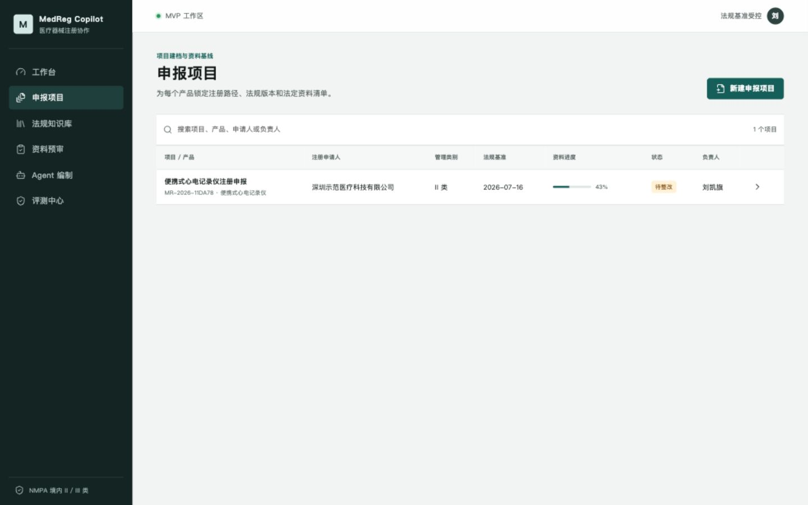
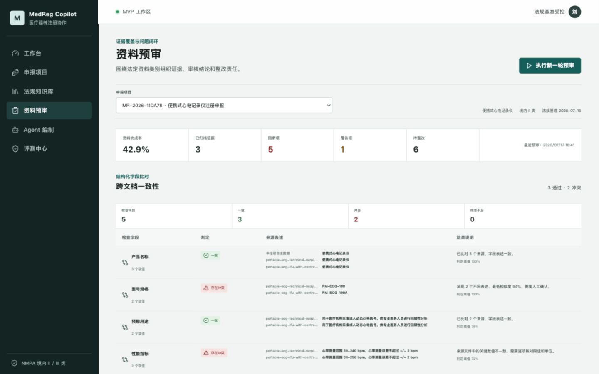
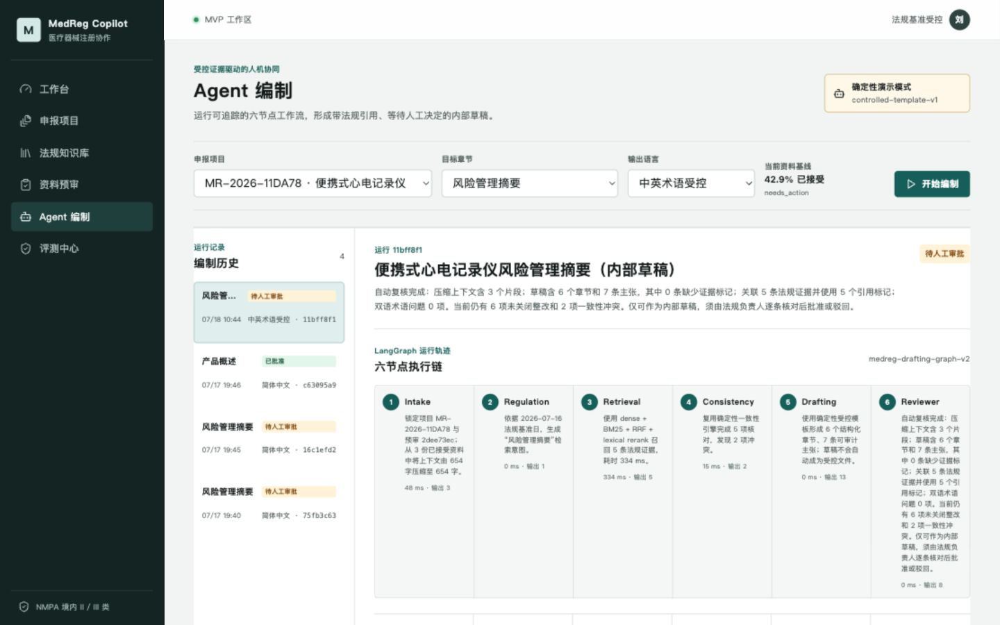

# MedReg Copilot

MedReg Copilot 是我为医疗器械注册资料准备场景做的个人项目。它把法规版本、申报资料、预审问题和 Agent 草稿放在同一条可追溯流程中，重点验证复杂文档处理、带来源的检索，以及大模型参与合规工作时的人机边界。

系统只用于资料准备和内部预审，不给出注册结论，也不能替代法规人员、检测机构或监管部门。



| 资料预审 | Agent 编制 |
| --- | --- |
|  |  |

## 演示场景

仓库内置一个便携式心电记录仪的虚构申报项目和公开法规样本。使用者可以：

1. 创建二类或三类器械申报项目，生成七类资料清单。
2. 上传 PDF、DOCX、XLSX 或文本资料，查看解析结果和原文位置。
3. 对资料完整性以及产品名称、型号、预期用途、性能和警示语做跨文档检查。
4. 从法规原文中检索证据，让 Agent 起草指定章节。
5. 查看草稿中的事实主张、资料证据和法规引用，再由审核人接受或驳回。
6. 导出带问题状态、引用坐标和文件指纹的内部预审报告。

演示数据会刻意放入一处型号和性能冲突，便于验证预审链路，而不是把一套完全正确的静态结果展示出来。

## 主要实现

### 文档入口

文件写入 MinIO 前会检查签名、OOXML 解压大小和压缩比，并拒绝宏、嵌入对象、危险路径及主动 HTML。解析任务由 Celery 执行；章节、表格、单元格坐标、解析器版本和内容哈希保存到 PostgreSQL，失败任务可以重试并防止旧 Worker 覆盖新结果。

### 法规检索

法规按章、节、条建立层级，再切成保留字符区间和父级路径的 Chunk。检索使用 Qdrant Dense 与 BM25 两路召回，通过 RRF 融合并按中文短语覆盖重排。返回结果包含法规版本、条款路径、原文位置和分数。

Neo4j 用于查询版本替代、上位法引用、适用范围和资料要求关系，但不作为法规原文的事实源；图谱可以从 PostgreSQL 和 MinIO 重建。

### Agent 编制

LangGraph 工作流包含需求整理、法规选择、证据检索、一致性检查、草稿生成和复核六个节点。DeepSeek 只接收已审核资料的相关片段，输出被约束为章节和带证据标记的事实主张。没有密钥或调用失败时，界面会明确显示受控演示结果，不会冒充实时模型输出。

草稿批准和驳回是独立终态操作。租户、角色、关键写操作和报告导出都有审计记录。

### 评测

仓库内有 60 条版本化合成样本，用于回归检索、引用、冲突识别、结构化输出和耗时。当前固定版本得到：

- Recall@5：`91.67%`
- 引用覆盖率：`95.00%`
- 冲突识别 F1：`92.68%`
- P95：`297 ms`（基线 `656 ms`）

这些数字只描述合成演示集，不代表真实注册项目效果。评测运行会保存数据集哈希、参数和门禁结果，领域专家复核被设计为独立状态。

## 技术组成

- 后端：Python、FastAPI、SQLAlchemy AsyncIO、Alembic、Celery
- 数据与检索：PostgreSQL、MinIO、Redis、Qdrant、Neo4j
- Agent：LangGraph、DeepSeek API、结构化输出与人工审批
- 前端：React、TypeScript、TanStack Query
- 运行：Docker Compose、Nginx、非 root 容器和文件密钥

详细结构见 [`docs/architecture.md`](docs/architecture.md)，数据使用边界见 [`docs/data-policy.md`](docs/data-policy.md)。

## 本地运行

需要 Docker Desktop、Node.js 和 Python 3.12/3.13。

```bash
make bootstrap
make demo-up
```

完成后访问：

- Web：<http://localhost:5273>
- API：<http://localhost:8200/docs>
- 评测中心：<http://localhost:5273/evaluation>
- 权限审计：<http://localhost:5273/audit>

日常开发可以运行 `make dev`。数据库迁移、Worker 和完整基础设施也可以分别通过 Makefile 启动。

## DeepSeek 配置

在被 Git 忽略的 `.env` 中设置：

```bash
DEEPSEEK_API_KEY=your-key
DEEPSEEK_BASE_URL=https://api.deepseek.com
DEEPSEEK_MODEL=deepseek-chat
```

密钥只由后端读取，不进入前端响应、运行快照或日志。

## 验证

```bash
make test
make test-integration
make lint
make build
```

当前基线为 68 项单元/API 测试和 8 项 PostgreSQL、MinIO、Redis、Qdrant、Neo4j 集成测试。

## 部署说明

`compose.production.yaml` 提供单机部署基线，包括迁移门禁、健康检查、日志轮转、文件密钥以及五类数据卷的备份恢复脚本。它默认只在 `127.0.0.1:8080` 暴露 Web；公网使用仍需要 HTTPS、可信域名、企业身份接入、独立恶意文件扫描和正式密钥轮换。步骤见 [`docs/production-deployment.md`](docs/production-deployment.md)。

## 已知边界

- 法规样本来自公开来源，产品和申报资料均为虚构演示数据。
- 合成评测集尚未经过医疗器械法规专家正式标注和签署。
- 系统实现的是资料预审与辅助编制，不自动判断产品是否合规或能否获批。
- 当前生产配置是单机基线，没有宣称完成多机高可用或真实 SaaS 运营。
