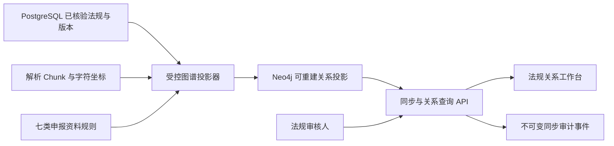
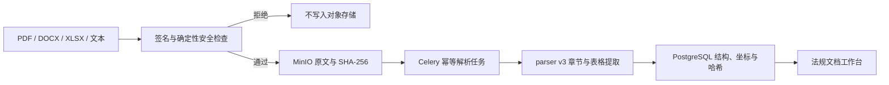
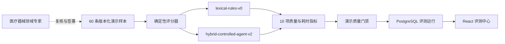
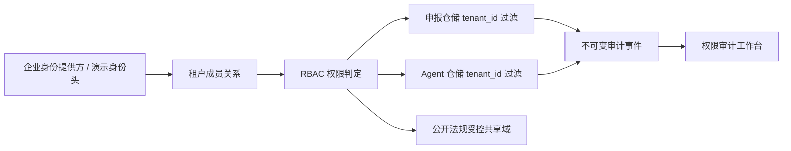

# 系统架构

## 全景

```mermaid
flowchart LR
    subgraph users["法规与研发团队"]
        ra["法规事务"]
        clinical["临床评价"]
        quality["质量管理"]
        reviewer["审核负责人"]
    end

    subgraph app["应用层"]
        web["React 工作台"]
        api["FastAPI 模块化单体"]
        worker["Celery Worker"]
        graph["LangGraph Agent"]
    end

    subgraph intelligence["文档与知识层"]
        parser["版面/表格/章节解析"]
        retrieval["Dense + BM25 + Reranker"]
        rules["确定性规则引擎"]
        llm["DeepSeek / 可替换模型"]
    end

    subgraph data["数据层"]
        postgres["PostgreSQL"]
        minio["MinIO"]
        qdrant["Qdrant"]
        neo4j["Neo4j"]
        redis["Redis"]
    end

    users --> web --> api
    api --> postgres
    api --> minio
    api --> redis --> worker
    worker --> parser
    worker --> postgres
    worker --> minio
    graph --> retrieval
    graph --> rules
    graph --> llm
    retrieval --> qdrant
    retrieval --> neo4j
```

## 核心边界

- 结构化清单、必填项和状态流由业务服务决定，不交给 LLM 猜测。
- 法规原文、版本与适用日期是独立事实；新版本不能覆盖历史项目使用的旧版本。
- 向量检索负责召回，知识图谱表达引用、替代、适用和证据关系。
- Agent 只生成问题、解释和草稿；接受、驳回和导出受控版本必须由人操作。
- 对外 SaaS、模型和数据源通过适配器接入，领域服务不依赖具体供应商。
- M1.4 由 API 持久化任务状态后写入 Redis，Celery Worker 执行抓取与解析；任务编号阻止过期 Worker 覆盖新任务结果，Beat 定时恢复陈旧任务。
- M2.1 将法规原文确定性拆为章、节、条和重叠 Chunk；每个 Chunk 保留父级路径、原文字符区间、内容哈希及 parser/segmenter 版本，后续检索引用无需依赖 LLM 猜测来源。
- M2.2 由 Celery 将 Chunk 异步编码为 BGE 中文 Dense 与 BM25 稀疏向量，写入 Qdrant 命名向量；查询先通过 RRF 融合两路候选，再按中文短语覆盖重排，并回传法规版本、条款路径和原文字符区间。
- M4.1 使用 LangGraph 固定编排 Intake、Regulation、Retrieval、Consistency、Drafting 与 Reviewer 六节点；PostgreSQL 保存项目/预审输入快照、提示词、节点轨迹、法规引用、模型模式和人工决定。模型未配置或调用失败时使用明确标记的确定性受控模板，任何草稿都停留在独立人工审批状态。
- M4.2 仅从人工审核通过的申报证据构造模型上下文，按目标章节评分、分段并限制字符预算；每个入模片段保留文件、原文字符区间与 SHA-256。模型输出固定为章节、事实主张、证据标记和中英文术语表，Reviewer 再检查无证据主张及受控术语缺失或错译，并将三份审计报告随运行记录持久化。
- M5 使用版本化 60 条合成演示标注集执行离线确定性回归评测；评分器逐条计算基线与当前管线的检索、引用、冲突、Schema、采纳和耗时指标。数据集内容哈希、运行参数、指标与质量门禁写入 PostgreSQL，合成演示门禁和真实领域专家签署是两个独立状态。
- 生产强化 P1 将身份解析为租户、用户和成员角色，Owner、Reviewer、Editor、Viewer 分别获得递减的查看、编辑、复核和管理权限。企业申报及 Agent 运行在 SQL 查询层强制附带 `tenant_id`，公开法规保持受控共享；关键写操作和报告导出写入只追加的审计事件流。
- 文档强化 P2 在任何 MinIO 写入前执行确定性入口检查：校验文件签名、OOXML 内部结构、解压总量与压缩比，拒绝危险路径、加密条目、宏、嵌入对象、外部工作簿链接和主动 HTML。通过后由 parser v3 提取章节及 Word/Excel 表格，表头、数据行、工作表、来源坐标与内容哈希作为独立结构写入 PostgreSQL。
- 图谱强化 P3 由 PostgreSQL 已核验法规版本、文档结构和七类资料规则生成 `controlled-regulation-graph-v1` 投影，再以幂等替换方式写入 Neo4j。Neo4j 负责版本、引用、适用、要求和证据关系查询，不成为法规元数据或原文的事实源；任一投影都可从 PostgreSQL 与 MinIO 重建。

## 法规关系投影



## 受控文档入库链



## M5 评测链



## 领域模块

- `applications`：申报项目、产品上下文和资料清单。
- `regulations`：法规、条款、版本和适用关系。
- `documents`：文件、解析版本、章节、表格和字段。
- `precheck`：完整性规则、问题、证据矩阵和整改状态。
- `agent`：检索、冲突检查、草稿和人工审批。
- `evaluation`：标注集、运行记录和质量指标。
- `security`：租户、用户、成员角色、权限解析和不可变审计事件。

## 租户权限链


